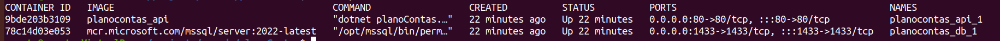

# Plano Conta

## Instruções para execução

### Pré-requisitos

Antes de executar o passo a passo abaixo é necessário ter o Docker e o plugin Docker-Compose instalados localmente. Em caso de dúvidas siga os links:
- [Instalação do Docker](https://docs.docker.com/get-docker/)
- [Instalação do Docker-Compose](https://docs.docker.com/compose/install/)

### Instruções

1. Após baixar o código fonte, entre na pasta *./planoContas* e execute o comando abaixo para fazer o build da aplicação e criar as imagens de container no Docker:

    `$ docker-compose build

1. Então execute um segundo comando para iniciar os containers:
    
    `$ docker-compose up -d

1. Verifique se os containers estão rodando, você precisará do nome do container que está rodando a API.

    `$ docker ps

    

1. Precisamos aplicar a criação das tabelas e inclusão de alguns dados iniciais no SQL executando o comando abaixo (note que usamos o nome do container *planoContas_api_1* criado):
    
    `$ docker exec planoContas_api_1 ./efbundle

E isso é tudo! Basta acessar [*http://localhost/swagger*](http://localhost/swagger) no navegador para ter acesso à documentação autogerada da API.